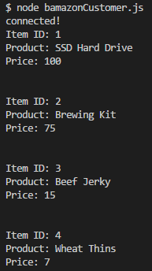

# bamazon

Bamazon is a command-line node app which allows users to change and manipulate item stock. It can be accessed by running "node bamazonCustomer.js" or "node bamazonManager.js" in CLI while inside the project directory.

* Bamazon customers are presented with a list of items and their prices, and prompted for what they wish to purchase.
* Bamazon managers are presented with the ability to view stock quantities as well as add items to current stock. 
  - as of 5/20/18 bamazonManager.js is not fully functional

After downloading the project, open the main file directory in your command line. You must: 

  * Enter "npm i" to install all required node packages
  * Start mamp to run a local database
  * Import seeds.sql using mysql workbench or similar program

Next, while in the main file directory in your command line:

  * Run "node bamazonCustomer.js" to start the program
  * You will then be be presented with a list of all items, their id #, and price
  

You will be prompted for the ID # of the product you would like to buy:

  * Look or scroll above to find the ID #
  * Enter the number into the command line
  * Enter how many you would like to purchase

  

  * You will be told which item you purchased, how many of them, and how much it cost
  * The program will then update the database and stop
  * You must enter "node bamazonCustomer.js" to run again

